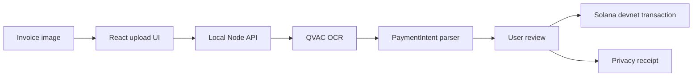

# Build Plan

## Product

CloakPay AI is a local-first payment assistant for Solana users. It reads invoice or payment images with QVAC OCR, extracts a payment intent, and helps the user prepare a devnet transfer while keeping sensitive invoice content on the user's machine.

## MVP Scope

- Web app with four panels: upload, extraction, review, receipt.
- Local Node API that owns QVAC model loading and OCR calls.
- Payment intent parser for recipient, amount, token, and memo.
- Devnet transaction preparation endpoint.
- Simulated privacy receipt for demo narrative.
- Public GitHub repo with clear setup and video path.

## Submission Demo Script

1. Start the app locally.
2. Upload a sample invoice image.
3. Show QVAC OCR blocks and extracted payment intent.
4. Edit/confirm fields that are ambiguous.
5. Prepare the devnet transaction payload.
6. Generate and show the privacy receipt.
7. Explain that the user invoice content was processed locally before transaction preparation.

## QVAC Integration

Primary integration: OCR using `@qvac/sdk`.

Planned second integration: local LLM completion to normalize messy OCR output and produce explanations for risk warnings. Keep OCR as the minimum working integration because it is directly tied to the core product behavior.

## Architecture



## Data Contracts

```ts
export type PaymentIntent = {
  recipientAddress: string;
  amount: number;
  token: "SOL" | "USDT";
  memo: string;
  confidence: number;
  warnings: string[];
};

export type PrivacyReceipt = {
  commitment: string;
  nullifierHash: string;
  stealthLabel: string;
  createdAt: string;
  txSignature?: string;
};
```

## Milestones

1. Repo connected and README complete.
2. UI and API scaffold runnable.
3. Mock extraction demo polished.
4. Live QVAC OCR model path verified.
5. Wallet signing and devnet explorer link added.
6. Video walkthrough recorded and submission packaged.
